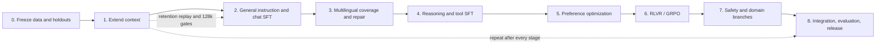

# Operational post-training plan

This plan turns the catalogue into a sequence that can guide an integration
build. It is based on artifacts verified on 2026-08-18 from the OpenEuroLLM
Hugging Face organization, project repositories, Mattermost, and read-only
inspection of LUMI.

The plan is deliberately evidence-aware:

- **Confirmed** means the data or completed artifact was inspected at a public
  revision or concrete cluster path.
- **Runnable** means a compatible configuration and concrete data exist, but a
  production data freeze has not yet been approved.
- **Proposed** means a pilot recipe or mixture to test. It is not a claim about
  a completed OpenEuroLLM run.
- **Blocked** means a required dataset, verifier, evaluation, framework feature,
  or release decision is missing.

## Recommended sequence

Context extension must happen before short-sequence post-training when the
release target is 64k or longer. This is not merely conventional ordering:
Jouni Luoma reported that 32k SFT after 128k extension destroyed Poro-long's
long-context capability
([Mattermost, 2026-08-17](https://mattermost.ufal.mff.cuni.cz/openeurollm/pl/fgm6gwbnybg6tpyesjeiciu5rw)).
Every later stage therefore has a long-context retention gate.

## Current readiness

| Stage | Current state | Strongest available asset | Main blocker |
| --- | --- | --- | --- |
| [0. Data freeze](00-DATA-FREEZE.md) | Partial | Decontaminated OpenEuroLLM releases and evaluation holdouts | No single immutable production manifest, license decision, or cross-stage deduplication report |
| [1. Context extension](01-CONTEXT-EXTENSION.md) | Confirmed to 128k on LUMI | [Jouni Luoma's 205 GB blend and completed lineage](../datasets/lumi-long-context-sample/README.md) | Reproduce from final Prelude; shared release root; multilingual 128k evaluation; 256k production decision |
| [2. Instruction/chat SFT](02-INSTRUCTION-CHAT-SFT.md) | Runnable for short context; long-retention candidate staged | Decontaminated/translated Dolci, EU-Instruct-Synthetic, and 18.3 GB English–Finnish long-SFT candidate | Long asset lacks lineage, lengths, and verified assistant mask; several chat templates are unsafe for assistant-only loss |
| [3. Multilingual repair](03-MULTILINGUAL-REPAIR.md) | Runnable but uneven | 13-language general SFT union plus 15-language repair set | Many official languages have only narrow repair data, not broad native instruction data |
| [4. Reasoning/tools](04-REASONING-AND-TOOLS.md) | English runnable; several LUMI candidates need freeze | Decontaminated Dolci Think/Nemotron, OpenR1 Math, 40.2 GB AM think mix, and Glaive code | Local lineage/correctness plus multilingual reasoning/tool data and common quality gates are missing |
| [5. Preference](05-PREFERENCE-OPTIMIZATION.md) | Runnable for DPO | Translated Dolci DPO and decontaminated SmolTalk2 | Preference fidelity after translation and low-resource coverage are unverified |
| [6. RLVR/GRPO](06-RLVR-GRPO.md) | Blocked for common pipeline | Exam MCQ, math/code/IF candidate sets | OpenEuroLLM post-training framework has no GRPO path or approved verifier suite |
| [7. Safety/domains](07-SAFETY-AND-DOMAINS.md) | Medical pilot only | Swedish medical SFT/DPO and exam artifacts | No production multilingual safety/civic/refusal dataset |
| [8. Integration/release](08-INTEGRATION-EVALUATION-RELEASE.md) | Partial | Multilingual holdouts, LUMI FLORES/Tatoeba, ArenaHard-EU, Prelude scores | No signed common gate, multilingual long-context benchmark, or release artifact manifest |

## Two build tracks

### Track A — integration build now

Use this to exercise the pipeline while gaps are being filled:

1. Freeze a small, decontaminated subset of each selected source.
2. Start from the latest approved Prelude checkpoint.
3. Reproduce the 16k -> 64k -> 128k context curriculum on a smaller token
   budget or use the verified 128k checkpoint as an engineering input.
4. Run general SFT, a multilingual SFT ratio sweep, reasoning/tool branches,
   and DPO.
5. Skip RLVR and flagship safety claims unless their blockers are closed.
6. Evaluate and publish a full run manifest even if the model is not a release
   candidate.

### Track B — flagship candidate

Do not start the expensive run until every P0 item in
[DATA_GAPS.md](DATA_GAPS.md) has an owner and acceptance evidence. In
particular, the build needs a strategy that prevents SFT from erasing 128k
capability, an approved multilingual safety set, and an immutable data freeze.

## Rules that apply to every stage

1. Never train on anything marked `eval-only`.
2. Pin public dataset and model revisions; cluster paths alone are insufficient.
3. Materialize a stage-specific train/dev split before training and hash it.
4. Run the decontamination search against all protected evaluations before the
   stage starts.
5. Inspect the formatted text and trainable-token mask for every input source.
6. Measure examples, total tokens, trainable tokens, sequence-length
   percentiles, languages, and per-source weights after filtering.
7. Keep a general/multilingual replay component in capability-specific SFT.
8. Evaluate base, multilingual, instruction, safety, and long-context retention
   after every checkpoint that can feed the next stage.
9. Promote only an immutable checkpoint with code, data, container, logs, and
   evaluation manifests.

See [FRAMEWORKS.md](FRAMEWORKS.md) for what is runnable in Megatron,
Megatron Bridge, TRL, LlamaFactory, and OLMo-core, and
[LANGUAGE_COVERAGE.md](LANGUAGE_COVERAGE.md) for capability gaps by language.
